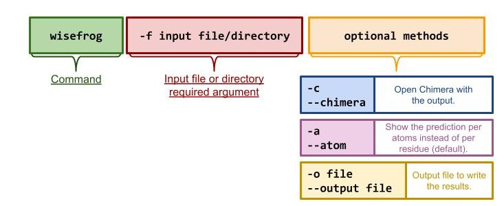
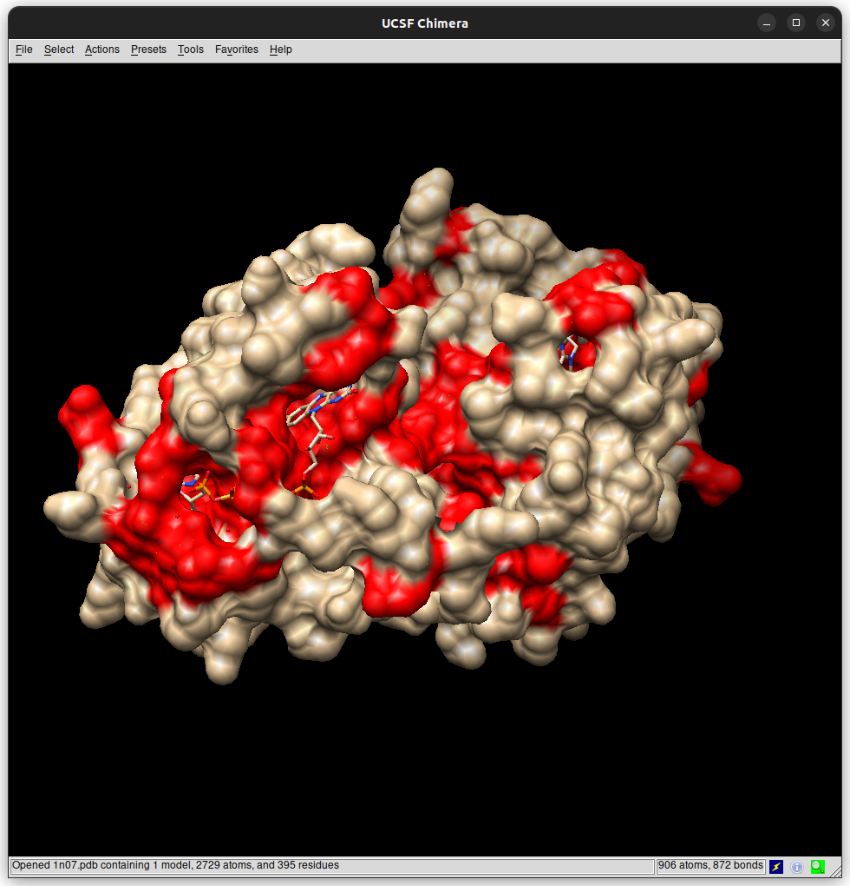

# wisefrog

wisefrog is a Deep Learning based model that classifies LBS according to the physical and chemical properties of atoms. Moreover, our model characterizes atoms by its environment (geometrically, the atoms that surround it), which gives a precise and specific perspective of how LBS are composed and classifies whether an atom or residue belongs to a LBS or not. 

We decided on the “wisefrog” name for many reasons. The term “Wise” conveys the idea of intelligence, sagacity, and deep understanding. Meanwhile, "Frog" symbolizes adaptability, agility, and precision, akin to the predictor's ability to navigate diverse environments and accurately identify LBS. All in all, just as a frog captures its prey with precision and efficiency, "WiseFrog" encapsulates the intelligence, adaptability, and precision essential for a successful ligand binding site predictor.

It has been developed by Jone Gutiérrez Díez and Martín Suárez Álvarez

## Tutorial

As this tutorial focuses on a Python-based model, it will comprehensively cover its usage, starting from basic operations such as program initialization and simple output generation, all the way to exploring its full potential in handling more complex tasks and functionalities

### Introduction

**SETTING UP THE ENVIRONMENT: INSTALLATION**

The first step to follow is downloading the setup package from the GitHub repository (dist/wisefrog-0.1.tar.gz).
A specific version (if necessary) of all the required packages will be downloaded when installing wisefrog. Thus, we recommend creating a new conda environment to avoid incompatibilities.

```
conda create wisefrog_env
conda activate  wisefrog_env
```

We’ll proceed to the installation:

```
pip install wisefrog-0.1.tar.gz
```

This might take some minutes, be patient! Once the installation has ended the user will be able now, to predict ligand binding sites with wisefrog. 


### Basic concepts

This package gives priority to user-friendliness and ease of use. So, always remember following the basic structure we suggest:



### Walkthrough

**USING WISEFROG TO PREDICT LBS FROM A SINGLE PDB FILE**

We’ll start running a simple command, wisefrog requires the file flag in order to run properly  – note that wisefrog will only read files in pdb format:

```
wisefrog -f file_name.pdb
```


  The output will be displayed in your terminal following this structure:

```
========File: file_name.pdb======== 
RESIDUE:

# List of residues.
```

**USING WISEFROG TO PREDICT LBS FROM A PDB FILE FROM RCSB PDB**

It is just the same as before but in this case wisefrog will get directly the PDB file from RCSB PDB, so the user don’t have to download it. This will download the PDB file, predict the LBS and immediately remove the file:

```
wisefrog -f web/pdb_id

```

In this case wisefrog will directly request the file, and the output will be displayed in your terminal following this structure:

```
Downloading from https://files.rcsb.org/download/pdb_id.pdb
========File: pdb_id.pdb======== 
RESIDUE:
# List of residues.
```

**USING WISEFROG TO PREDICT LBS FROM MULTIPLE PDB FILES**

To analyze multiple PDB files at the same time the only requirement is to store all the files in the same directory, then run this command line:

```
wisefrog -f directory_name
```

The output will be displayed in your terminal following this structure:

```
========File: directory_name/file_name_1.pdb======== 
RESIDUE:
# List of residues.

========File: directory_name/file_name.pdb======== 
RESIDUE:
# List of residues.
```

**VISUALIZATION OF THE RESULT**

In order to get a visual support of the prediction, wisefrog reckons with a method to open Chimera:

```
wisefrog -f file_name -c 
```

This time, the output will also be displayed in the terminal, but additionally Chimera will be opened, displaying the residues classified as LBS in red.


**GETTING THE OUTPUT PER ATOM**

In case the user desires to get a more precise output, wisefrog contains a method for it, which can be used together with all other methods:

```
wisefrog -f file_name.pdb -c -a
```

The output will be shown in the terminal as following:

```
========File: file_name.pdb========
ATOM         RESIDUE

# List of atoms and residues organized in columns as titles refer.

```

**REDIRECTING THE OUTPUT TO AN OUTPUT FILE**

Saving the results is crucial for a scientist, thus output flag will manage this task:

```
wisefrog -f file_name.pdb -c -a -o output.out
```

In this case the output won’t be shown in the terminal, but in the desired output file. Take into account that if the output file is not empty, the content won’t be overwritten by the output, but appended. The format of the output will be the same as the one shown when displayed in the terminal.
Note that in bash, flags can be combined, as in -cao.


### Examples and use cases

**EXAMPLE 1: USING WISEFROG TO PREDICT LBS FROM PDB ENTRY 1N07**

As said before, the user should always follow the standard command line:

```
wisefrog -f ./1n07.pdb -c
```

This very simple command categorizes which residue belongs to the LBS of the proteins, adding the chimera flag the output will look like this:

```
========File: 1n07.pdb========


RESIDUE:

ILE12
GLY14
PRO15
GLN19
SER20
TYR22
ILE24
ARG25
PHE26
HIS32
GLY35
ARG36
SER38
…
You can use this selection in chimera to visualize the binding atoms:

:12@CG2,:14@N,:14@CA,:14@C,:14@O,:15@N,:15@CA,:19@CG,:19@OE1,:19@NE2,:20@C,:20@O,:20@OG,:22@CD1,:22@CE1,:22@CZ,:22@OH,:24@CG1,:25@O,:26@CA,:26@CE2,:32@NE2,:35@N,:36@CB,:36@CD,:36@NE,:36@CZ,:36@NH1,:36@NH2,:38@CB,:38@OG,:39@CB,:39@CG,:39@CE,:42@O,:44@CA,:44@C,:44@O,:44@CB,:44@CG,:45@N,:45@CA,:45@C,:45@O,:45@CB,:45@OG1,:45@CG2,:46@N,:46@CA,:46@C,:46@CB,:47@CG,:47@OD1,:47@ND2,:52@O,:56@O,:56@CG,:56@CD1,:56@CD2,:59@CA,:59@C,:59@O,:59@CG,:59@CD2,:59@CE2,:60@N,:60@C,:60@CG,:60@CD,:60@NE,:60@CZ,:60@NH2,:61@N,:61@CA,:61@CB,:61@CG,:61@OD1,:61@OD2,:62@N,:62@CA,:62@OG,:64@CG2,:65@CD2,:70@CE,:78@O,:79@C,:79@O,:80@O,:81@N,:81@CA,:81@C,:81@O,:81@CB,:81@OG,:88@CD2,:88@CZ,:91@NZ,:94@CA,:94@O,:95@O,:96@O,:96@CB,:96@CG,:96@CD,:96@OE1,:96@OE2,:97@O,:97@CB,:98@C,:98@O,:98@ND1,:99@N,:103@O,:106@OD2,:107@CD2,:107@CE1,:107@CE2,:107@CZ,:108@CE1,:108@CZ,:112@CA,:112@SD,:118@CA,:119@CA,:119@O,:120@O,:123@CG,:123@CD,:123@OE1,:123@OE2,:126@CG,:126@CD1,:126@CE1,:126@CZ,:127@C,:132@CG,:132@CD1,:132@CD2,:136@N,:136@CA,:136@CG1,:136@CD1,:139@CG,:139@OD1,:149@NH1,:154@OG

```




